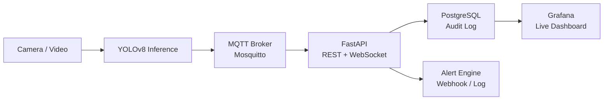

# 🔍 Autonomous Visual Inspection Pipeline

A production-style industrial defect detection system — camera frames flow through a YOLOv8 model, detections are published via MQTT, stored in PostgreSQL, visualised on a live Grafana dashboard, and trigger automated alerts when thresholds are exceeded. Everything runs in Docker with a single command.


---

## 📋 Project Overview

This project solves a real industrial problem: **manual visual QA is slow, subjective, and doesn't scale**. A human inspector gets tired, misses defects, and can't process hundreds of items per minute.

The pipeline automates this end-to-end with a **5-layer architecture**:

1. **Inference Layer** (`inference/main.py`) — captures frames, runs YOLOv8, publishes detections
2. **Message Broker** (Mosquitto) — decouples inference from the backend via MQTT
3. **API Layer** (`api/`) — subscribes to MQTT, stores data, exposes REST + WebSocket
4. **Storage Layer** (PostgreSQL) — full audit log of every detection and alert
5. **Observability Layer** (Grafana) — live dashboard provisioned as code

The system runs in **demo mode** by default — generates synthetic conveyor-belt frames with realistic defects so the full pipeline works without any camera hardware.

---

## 🎮 Features

- **Real-time defect detection** — frames processed at up to 10 fps, detections published instantly via MQTT
- **Live Grafana dashboard** — defects per minute, class breakdown, confidence distribution, alert history — auto-refreshes every 10s
- **Full audit log** — every detection stored with timestamp, class, confidence score, and bounding box coordinates
- **Configurable alerting** — threshold adjustable via REST API at runtime with no restart needed
- **Live WebSocket feed** — `ws://localhost:8000/ws/live` pushes every detection for frontend integration
- **Demo mode** — synthetic conveyor-belt frames, no camera needed
- **Dashboards as code** — Grafana datasource and dashboard provisioned from JSON/YAML automatically
- **CI/CD pipeline** — lint → typecheck → tests → build → push to GitHub Container Registry

---

## 🛠 Technologies Used

| Layer | Technology |
|---|---|
| Inference | Python, YOLOv8 (Ultralytics), OpenCV, NumPy |
| Message Broker | MQTT — Eclipse Mosquitto |
| Backend API | FastAPI, async SQLAlchemy, aiomqtt, Pydantic |
| Database | PostgreSQL 16, Alembic migrations |
| Dashboard | Grafana 11 (provisioned as code) |
| Containerisation | Docker, Docker Compose |
| CI/CD | GitHub Actions, GitHub Container Registry |

---

## 🏗 Architecture

```
┌─────────────────┐     ┌──────────────────┐     ┌─────────────────┐
│  Camera / Video  │────▶│  YOLOv8 Inference│────▶│  MQTT Broker    │
│  (OpenCV)        │     │  (Python)        │     │  (Mosquitto)    │
└─────────────────┘     └──────────────────┘     └────────┬────────┘
                                                           │
                                                           ▼
┌─────────────────┐     ┌──────────────────┐     ┌─────────────────┐
│  Grafana         │◀────│  PostgreSQL       │◀────│  FastAPI        │
│  Dashboard       │     │  (Audit log)      │     │  REST + WS      │
└─────────────────┘     └──────────────────┘     └────────┬────────┘
                                                           │
                                                           ▼
                                                  ┌─────────────────┐
                                                  │  Alert Engine   │
                                                  │  Webhook / Log  │
                                                  └─────────────────┘
```



---

## 📦 Prerequisites

| Tool | Purpose |
|---|---|
| [Docker Desktop](https://www.docker.com/products/docker-desktop/) | Runs all services in containers |
| Git | Clone the repo |

That's all. Python, PostgreSQL, Grafana — everything else runs inside Docker. Nothing else to install.

---

## 🚀 How to Run

```bash
# 1. Clone the repository
git clone https://github.com/kaskus90/Autonomous_Visual_-Inspection_-Pipeline.git
cd Autonomous_Visual_-Inspection_-Pipeline

# 2. Copy environment config
cp .env.example .env

# 3. Build and start everything
docker compose up --build
```

First run takes 3–5 minutes (pulls images, builds containers). Subsequent starts take under 10 seconds.

---

## 🎯 How to Use

1. **Open Grafana** → http://localhost:3001/d/inspection-overview — watch detections flow in live
2. **Open API docs** → http://localhost:8000/docs — interact with every endpoint in the browser
3. **Change alert threshold** → POST `/alerts/config` with `{"defect_rate_threshold": 20, "window_seconds": 60}` — takes effect instantly
4. **Watch alerts fire** → Alert History table in Grafana updates automatically when defect rate exceeds threshold
5. **Connect your frontend** → WebSocket at `ws://localhost:8000/ws/live` — every detection pushed in real time

---

## 📊 Dashboard Panels

Navigate to **http://localhost:3001/d/inspection-overview**

| Panel | Description |
|---|---|
| Defects per Minute | Time series of detection rate over the last hour |
| Total Detections | Running count since startup |
| Avg Confidence | Mean model confidence across all detections |
| Defect Class Breakdown | Donut chart — scratch / dent / crack / contamination / discoloration |
| Confidence Distribution | Histogram of model confidence score spread |
| Alert History | Every alert fired — time, line, defect count, threshold |

---

## 🌐 Running Services

| Service | URL | Credentials |
|---|---|---|
| Grafana dashboard | http://localhost:3001 | anonymous viewer — no login needed |
| Grafana admin | http://localhost:3001 | admin / admin |
| API docs (Swagger) | http://localhost:8000/docs | — |
| Live WebSocket | ws://localhost:8000/ws/live | — |
| PostgreSQL | localhost:5432 | inspector / inspector_pass |
| MQTT broker | localhost:1884 | — |

---

## 🔌 API Endpoints

| Method | Endpoint | Description |
|---|---|---|
| `GET` | `/detections` | Paginated detection history — params: `limit`, `offset`, `line_id` |
| `GET` | `/detections/stats` | Total count, last-minute count, top 5 defect classes |
| `GET` | `/alerts/config` | Current alert threshold configuration |
| `POST` | `/alerts/config` | Update threshold and window — live, no restart |
| `GET` | `/alerts/history` | Full alert audit log, newest first |
| `WS` | `/ws/live` | Real-time detection stream (WebSocket) |
| `GET` | `/health` | Health check |

### Quick Examples

```bash
# Get last 10 detections
curl "http://localhost:8000/detections?limit=10"

# Change alert threshold
curl -X POST http://localhost:8000/alerts/config \
  -H "Content-Type: application/json" \
  -d '{"defect_rate_threshold": 20, "window_seconds": 60}'
```

```javascript
// Connect to live WebSocket feed
const ws = new WebSocket("ws://localhost:8000/ws/live");
ws.onmessage = (event) => console.log(JSON.parse(event.data));
```

---

## 📹 Video Source Options

Set `VIDEO_SOURCE` in `.env`:

| Value | Behaviour |
|---|---|
| `demo` | Synthetic conveyor-belt frames — no hardware needed **(default)** |
| `0` | Webcam index 0 (USB or built-in camera) |
| `/data/sample.mp4` | Video file mounted into the container |

### Using a video file

1. Place `sample.mp4` next to `docker-compose.yml`
2. Uncomment in `docker-compose.yml` under `inference`:
   ```yaml
   - ./sample.mp4:/data/sample.mp4:ro
   ```
3. Set in `.env`: `VIDEO_SOURCE=/data/sample.mp4`
4. Restart: `docker compose up -d`

---

## 🔔 Setting Up Alerts (Discord / Slack)

1. Create a webhook — *Discord: Server Settings → Integrations → Webhooks → New Webhook → Copy URL*
2. Add to `.env`:
   ```
   ALERT_WEBHOOK_URL=https://discord.com/api/webhooks/your/webhook
   ```
3. Restart the API: `docker compose restart api`

Alerts fire automatically when defect rate exceeds the threshold. All alerts are also logged to the database regardless of webhook config.

---

## 🧪 Running Tests Locally

```bash
# Install dependencies
pip install -r api/requirements.txt -r tests/requirements-test.txt

# Run tests
pytest tests/ -v
```

Tests run against an in-memory SQLite database — no Docker needed, no external services required.

---

## ⏹ Stopping the System

```bash
# Stop containers, keep data
docker compose stop

# Stop and remove everything including data volumes
docker compose down -v
```

---

## 📁 File Structure

```
├── inference/
│   ├── main.py                  # Frame loop, demo mode, MQTT publisher
│   ├── Dockerfile
│   └── requirements.txt
│
├── api/
│   ├── main.py                  # FastAPI routes, WebSocket, lifespan
│   ├── mqtt_subscriber.py       # MQTT → database + live queue
│   ├── alerts.py                # Threshold checker + webhook delivery
│   ├── models.py                # SQLAlchemy ORM models
│   ├── schemas.py               # Pydantic request/response schemas
│   ├── database.py              # Async engine + session factory
│   ├── config.py                # Settings via pydantic-settings
│   └── Dockerfile
│
├── db/
│   └── migrations/
│       └── versions/
│           └── 0001_initial_schema.py   # Full up/down migration
│
├── grafana/
│   ├── provisioning/
│   │   ├── datasources/         # Auto-wired PostgreSQL datasource
│   │   └── dashboards/          # Dashboard loader config
│   └── dashboards/
│       └── inspection_overview.json     # Dashboard as code
│
├── mosquitto/
│   └── mosquitto.conf           # MQTT broker config
│
├── tests/
│   └── test_api.py              # Async endpoint tests (pytest + httpx)
│
├── .github/workflows/
│   └── ci.yml                   # Lint → typecheck → test → build → push
│
├── docker-compose.yml           # Full stack — one command to run
├── .env                         # Your local config (not committed)
└── .env.example                 # Template — copy this to .env
```

---

## 🗄 Database Schema

**`detections`** — one row per detection event
```
id, event_id (UUID), frame_id, line_id, timestamp
class_name, confidence (float), bbox (JSON: x1/y1/x2/y2)
```

**`alert_configs`** — per-line alert threshold (editable via API)
```
line_id, defect_rate_threshold, window_seconds
```

**`alert_logs`** — immutable audit trail of every alert fired
```
line_id, defect_count, threshold, fired_at
```

---

## ⚙️ CI/CD Pipeline

**On every pull request:**
1. `ruff` — lint Python code
2. `mypy` — static type checking
3. `pytest` — async API tests (SQLite in-memory, no external deps)

**On merge to `main`:**

4. Build `inference` Docker image → push to `ghcr.io`
5. Build `api` Docker image → push to `ghcr.io`

Pull images directly:
```bash
docker pull ghcr.io/kaskus90/avip-inference:latest
docker pull ghcr.io/kaskus90/avip-api:latest
```

---

## 📈 Scaling Path

| Requirement | Solution |
|---|---|
| Multiple camera lines | Add `line_id` routing in MQTT topics — schema already supports it |
| Higher message throughput | Swap Mosquitto for Kafka — subscriber interface stays the same |
| Real defect detection | Fine-tune YOLOv8 on MVTec AD, PCB defects, or NEU-DET dataset |
| Live alert delivery | Set `ALERT_WEBHOOK_URL` to Discord / Slack / PagerDuty in `.env` |
| Custom frontend | Connect React to `ws://host/ws/live` for annotated live video feed |
| Cloud deployment | Images already on GHCR — deploy with `docker compose` on any VPS |

---

## 🎓 Educational Value

This project demonstrates:
- End-to-end systems engineering — not just a model, a full pipeline
- Industrial IoT messaging patterns (MQTT, pub/sub)
- Async Python — FastAPI, SQLAlchemy, aiomqtt all fully async
- Database migrations with Alembic
- Observability and dashboards as code
- Docker multi-service orchestration
- CI/CD with GitHub Actions

---

## 👨‍💻 Author

Kuba K. (kaskus90)

## 📝 License

Open source for educational purposes.
